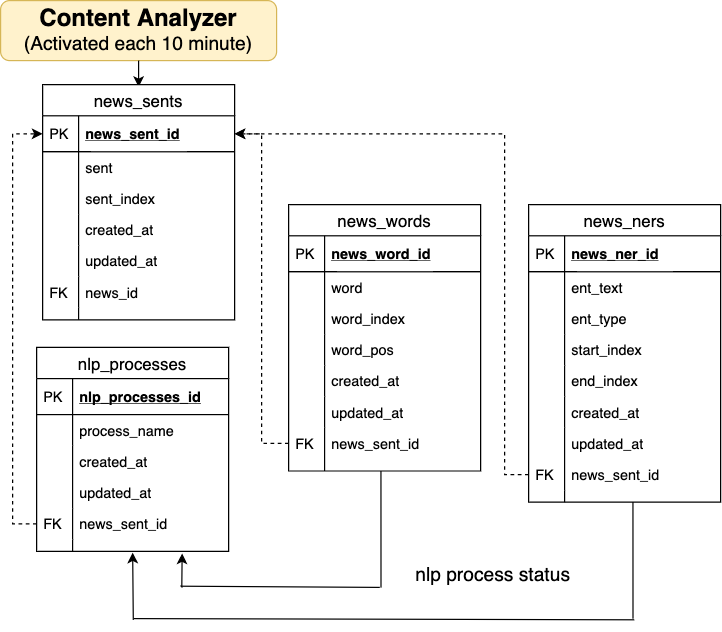

# Content Analyzer:

## Files:
* [sentence\_splitter.py](https://github.com/garyhsu29/chinese_nlp/blob/master/content_analyzer/sent_splitter.py): 依照設定好的 regular expression，將一篇新聞切分成多個句子，值得一提的是並不是單純用句號來區分句子，而是以段落的方式。（這個有待商榷，現在只是最初的測試階段）
* 

## [Data Definition Language](https://github.com/garyhsu29/chinese_nlp/blob/master/rss_parser/news_rss_feeds_ddl.sql) Explanation: