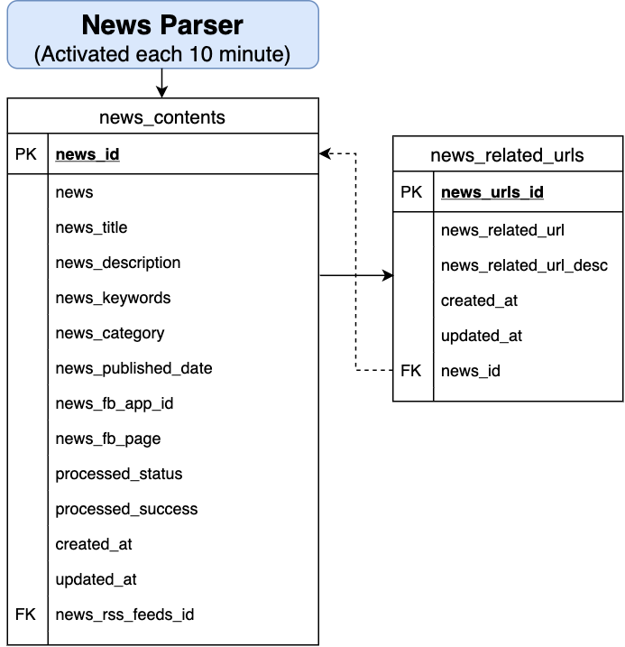

## News Parsing:

## Files:
* [content\_source\_top10.ipynb](https://github.com/garyhsu29/chinese_nlp/blob/master/news_parser/content_source_top10.ipynb): news parser 的開發 notebook
* [content\_parser.py](https://github.com/garyhsu29/chinese_nlp/blob/master/news_parser/content_parser.py): 負責處理資料的輸入輸出(SELECT, INSERT) 還有更新 processed\_status, processed\_success
* [*\_content\_parser.py](https://github.com/garyhsu29/chinese_nlp/blob/master/news_parser/epoch_content_parser.py): 負責處理新聞來源 * 的 python script

| # news_source                                                                                             | Status                    |
|-----------------------------------------------------------------------------------------------------------|---------------------------|
| [Yahoo奇摩股市](https://tw.stock.yahoo.com/rss_index.html)                                                | V                         |
| [自由時報(LTN)](https://service.ltn.com.tw/RSS)                                                           | V                         |
| [民報](https://www.peoplenews.tw/subscription)                                                            | X                         |
| [新頭殼](https://newtalk.tw/rss)                                                                          | V                         |
| [東森新聞(Ettoday)](https://www.ettoday.net/events/news-express/epaper.php)                               | V                         |
| [上報](https://www.upmedia.mg/rss.php)                                                                    | X                         |
| [風傳媒](https://www.storm.mg/feeds)                                                                      | X                         |
| [新浪台灣(Sina)](https://news.sina.com.tw/rss/index.html)                                                 | X (Too many invalid urls) |
| [Pchome](https://news.pchome.com.tw/member_rss/)                                                          | V                         |
| [中央通訊社(CNA)](http://rss.cna.com.tw/rsscna/)                                                          | X                         |
| [華視(CTS)](https://news.cts.com.tw/plugin/)                                                              | X                         |
| [台視(TTV)](https://www.ttv.com.tw/rss/)                                                                  | X                         |
| [大紀元(Epoch)](https://www.epochtimes.com/b5/djy-rss.htm)                                                | V                         |
| [聯合新聞網-經濟日報](https://money.udn.com/rssfeed/lists/1001)                                           | V                         |
| [商業週刊（內容與新聞差異較大，未放入資料庫）](https://www.businessweekly.com.tw/RSS)                     | X                         |
| [天下雜誌（內容與新聞差異較大，未放入資料庫）](https://www.cw.com.tw/article/article.action?id=5070394)   | X                         |
| [MSN](https://rss.msn.com/zh-tw/)                                                                         | V                         |
| [公視(PTS)](https://about.pts.org.tw/rss/XML/newsfeed.xml)                                                | V                         |
| [上下游新聞(Newsmarket)](https://www.newsmarket.com.tw/feed/)                                             | X                         |
| [報導者新聞(內容為專文，和新聞文章差異較大，未放入資料庫)](https://www.twreporter.org/a/rss2.xml)         | X                         |
| [苦勞網(內容為專文，和新聞文章差異較大，未放入資料庫)](https://www.coolloud.org.tw/rss.xml)               | X                         |
| [公民新聞網](https://www.peopo.org/rss-news)                                                              | X                         |
| [MATA TAIWAN：為原住民內容，內文不多，未放入資料庫](https://www.matataiwan.com/feed/)                     | X                         |
| [信傳媒](https://www.cmmedia.com.tw/rss/yahoo/article)                                                    | X                         |
| [RTI 中央廣播電台](http://www.rti.org.tw/rss/)                                                            | V                         |
| [報橘](https://buzzorange.com/feed/)                                                                      | X                         |
| [關鍵新聞網](https://feeds.feedburner.com/TheNewsLens)                                                    | X                         |

## Data Definition Language [(1)](https://github.com/garyhsu29/chinese_nlp/blob/master/news_parser/news_contents_table_ddl.sql) [(2)](https://github.com/garyhsu29/chinese_nlp/blob/master/news_parser/news_related_urls_table_ddl.sql) Explanation:

### [news\_contents](https://github.com/garyhsu29/chinese_nlp/blob/master/news_parser/news_contents_table_ddl.sql):
* news\_id: primary key for table news\_contents
* news\_rss\_feeds\_id: foreign key to link table news\_rss\_feeds
* news: stores the news content which was provided by news\_url
* news\_title: stores the title of the news
* news\_description: stores the title of the news
* news\_keywords: stores the keywords of the news
* news\_category: stores the category of the news (if applicable)
* news\_published\_date: stores the published date of the news
* news\_fb\_app\_id: stores the facebook app id of the news (if applicable)
* news\_fb\_page: stores the facebook page of the news (if applicable)
* created\_at: stores the record created time
* updated\_at: stores the record last update time
* processed\_status: stores the process status of next level application (content analyzer)
* processed\_success: stores the content analyzer processes successfully

### [news\_related\_urls](https://github.com/garyhsu29/chinese_nlp/blob/master/news_parser/news_related_urls_table_ddl.sql):
* news\_urls\_id: primary key for table news\_related\_urls
* news\_related\_url: stores the related link of the news
* news\_related\_url\_desc:stores the related link description of the news
* news\_id: foreign key to link table news\_contents
