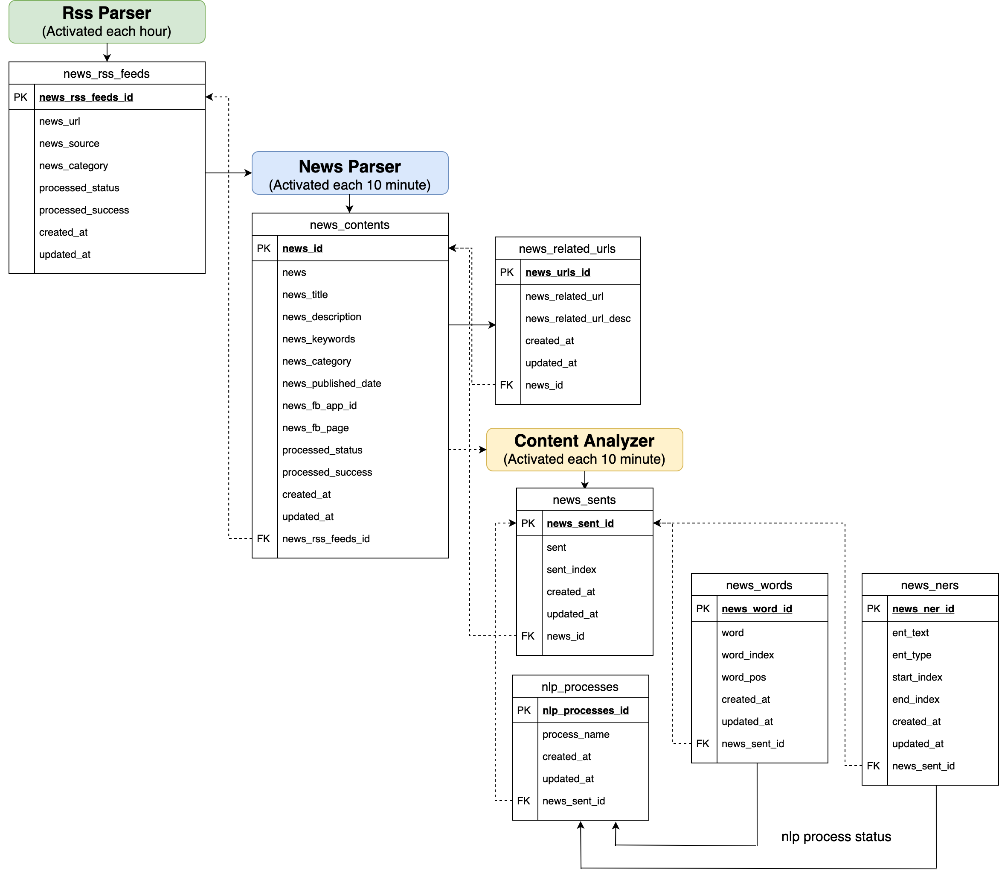

## 1. Chinese NLP project:

### 1. Rss parser
* 利用 requests 從 rss url 來獲取該 url 的內容
*  利用 Regular Expression/BeautifulSoup 從 url 的內容來獲取「標題 (title)」和「連結 (link)」
*  更多內容請參考資料夾 [rss parser](https://github.com/garyhsu29/chinese_nlp/tree/master/crawler)

### 2. News parser

